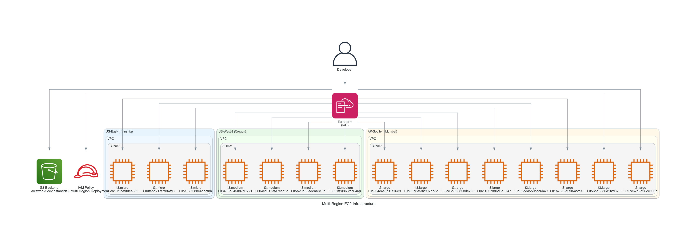

# 🌍 Multi-Region EC2 Deployment with Terraform

[](https://terraform.io)
[](https://aws.amazon.com)
[](LICENSE)

A complete Infrastructure-as-Code solution for deploying EC2 instances across multiple AWS regions with Terraform remote state management.

## 🏗️ Architecture Overview



```
┌─────────────────┬─────────────────┬─────────────────┐
│   US-East-1     │   US-West-2     │   AP-South-1    │
│   (Virginia)    │   (Oregon)      │   (Mumbai)      │
├─────────────────┼─────────────────┼─────────────────┤
│ 3x t3.micro     │ 4x t3.medium    │ 8x t3.large     │
│ (x86_64)        │ (x86_64)        │ (x86_64)        │
└─────────────────┴─────────────────┴─────────────────┘
```

**Total: 15 instances across 3 regions**

## ✨ Features

- 🌐 **Multi-Region Deployment**: Instances across US-East-1, US-West-2, and AP-South-1
- 🏗️ **Infrastructure as Code**: Complete Terraform configuration
- 📦 **Remote State**: S3 backend with versioning for team collaboration
- 🔧 **Configurable**: Easy to modify instance types and counts
- 📊 **Cost Optimized**: Right-sized instances for different workloads
- 🏷️ **Well-Tagged**: Proper resource tagging for management

## 🚀 Quick Start

### Prerequisites

- [AWS CLI](https://aws.amazon.com/cli/) configured with appropriate credentials
- [Terraform](https://terraform.io/downloads.html) >= 1.0 installed
- IAM permissions for EC2 and S3 operations

### 1️⃣ Clone Repository

```bash
git clone https://github.com/catchmeraman/mutiec2instance.git
cd mutiec2instance
```

### 2️⃣ Configure Variables (Optional)

```bash
# Copy example variables file
cp terraform.tfvars.example terraform.tfvars

# Edit variables as needed
nano terraform.tfvars
```

### 3️⃣ Initialize and Deploy

```bash
# Initialize Terraform with S3 backend
terraform init

# Review the deployment plan
terraform plan

# Deploy infrastructure
terraform apply
```

## 📋 Configuration

### Instance Configuration

| Region | Count | Instance Type | Architecture | Use Case |
|--------|-------|---------------|--------------|----------|
| US-East-1 | 3 | t3.micro | x86_64 | Development/Testing |
| US-West-2 | 4 | t3.medium | x86_64 | Staging |
| AP-South-1 | 8 | t3.large | x86_64 | Production |

### Variables Reference

```hcl
# terraform.tfvars
us_east_1_instance_count   = 3
us_west_2_instance_count   = 2
ap_south_1_instance_count  = 4

us_east_1_instance_type    = "t3.micro"
x86_instance_type_medium   = "t3.medium"
x86_instance_type_large    = "t3.large"

environment = "production"
```

## 🗂️ Project Structure

```
├── 📄 README.md                    # This documentation
├── 🏗️ main.tf                     # Main infrastructure configuration
├── 📊 backend.tf                   # S3 backend configuration
├── 🔧 variables.tf                 # Input variables
├── 📤 outputs.tf                   # Output values
├── 📋 versions.tf                  # Provider requirements
├── 📝 terraform.tfvars.example     # Example variables
└── 🚫 .gitignore                   # Git ignore rules
```

## 🔧 Backend Configuration

The project uses S3 remote state with the following configuration:

```hcl
terraform {
  backend "s3" {
    bucket = "awsweek2ec2instances"
    key    = "terraform/multi-region-ec2/terraform.tfstate"
    region = "us-east-1"
  }
}
```

### Benefits:
- ✅ **Team Collaboration**: Shared state across team members
- ✅ **State Locking**: Prevents concurrent modifications
- ✅ **Version History**: S3 versioning enabled for rollbacks
- ✅ **Backup**: State stored securely in AWS

## 📊 Outputs

After deployment, you'll get:

```bash
# Instance IDs for each region
us_east_1_instance_ids  = ["i-1234567890abcdef0", ...]
us_west_2_instance_ids  = ["i-0987654321fedcba0", ...]
ap_south_1_instance_ids = ["i-abcdef1234567890", ...]

# Public IP addresses
us_east_1_public_ips    = ["54.123.45.67", ...]
us_west_2_public_ips    = ["34.56.78.90", ...]
ap_south_1_public_ips   = ["13.45.67.89", ...]

# Total instance count
total_instance_count = 9
```

## 🛠️ Management Commands

### View Current Infrastructure
```bash
terraform show
```

### Update Instance Counts
```bash
# Modify terraform.tfvars or use command line
terraform apply -var="us_east_1_instance_count=5"
```

### Destroy Infrastructure
```bash
# Destroy specific region
terraform destroy -target="aws_instance.us_west_2_x86"

# Destroy everything
terraform destroy
```

### State Management
```bash
# List resources in state
terraform state list

# Show specific resource
terraform state show aws_instance.us_east_1_x86[0]
```

## 💰 Cost Estimation

Approximate monthly costs (On-Demand pricing):

| Region | Instance Type | Count | Monthly Cost* |
|--------|---------------|-------|---------------|
| US-East-1 | t3.micro | 3 | ~$7.50 |
| US-West-2 | t3.medium | 4 | ~$60.00 |
| AP-South-1 | t3.large | 8 | ~$240.00 |
| **Total** | | **15** | **~$307.50** |

*Estimates based on On-Demand pricing. Actual costs may vary.

## 🔒 Security Best Practices

- 🔐 **IAM Roles**: Use IAM roles instead of hardcoded credentials
- 🏷️ **Resource Tagging**: All resources properly tagged for management
- 🔒 **State Security**: S3 bucket with versioning and encryption
- 🌐 **Network Security**: Default security groups (customize as needed)

## 🚨 Troubleshooting

### Common Issues

#### 1. Permission Denied
```bash
# Check AWS credentials
aws sts get-caller-identity

# Verify IAM permissions for EC2 and S3
```

#### 2. State Lock Issues
```bash
# Force unlock if needed (use carefully)
terraform force-unlock <LOCK_ID>
```

#### 3. Backend Initialization
```bash
# Reinitialize if backend changes
terraform init -reconfigure
```

## 🤝 Contributing

1. Fork the repository
2. Create a feature branch (`git checkout -b feature/amazing-feature`)
3. Commit your changes (`git commit -m 'Add amazing feature'`)
4. Push to the branch (`git push origin feature/amazing-feature`)
5. Open a Pull Request

## 📄 License

This project is licensed under the MIT License - see the [LICENSE](LICENSE) file for details.

## 🔗 Useful Links

- [Terraform AWS Provider Documentation](https://registry.terraform.io/providers/hashicorp/aws/latest/docs)
- [AWS EC2 Instance Types](https://aws.amazon.com/ec2/instance-types/)
- [AWS Pricing Calculator](https://calculator.aws/)
- [Terraform Best Practices](https://www.terraform.io/docs/cloud/guides/recommended-practices/index.html)

## 📞 Support

- 🐛 **Issues**: [GitHub Issues](https://github.com/catchmeraman/mutiec2instance/issues)
- 📧 **Questions**: Create an issue with the `question` label
- 💡 **Feature Requests**: Create an issue with the `enhancement` label

---

<div align="center">

**⭐ Star this repository if it helped you! ⭐**

Made with ❤️ using Terraform and AWS

</div>
