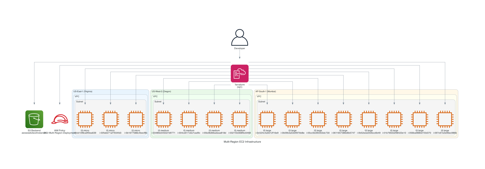

# 🏗️ Architecture Documentation

## Overview

This document provides detailed information about the multi-region EC2 infrastructure deployed using Terraform.



## Components

### 🌍 Regions

The infrastructure spans across three AWS regions for high availability and global reach:

1. **US-East-1 (N. Virginia)** - Primary development region
2. **US-West-2 (Oregon)** - Staging environment
3. **AP-South-1 (Mumbai)** - Production environment

### 💻 EC2 Instances

#### US-East-1 (Virginia)
- **Count**: 3 instances
- **Type**: t3.micro
- **Architecture**: x86_64
- **Use Case**: Development and testing
- **Instance IDs**:
  - i-0cb10f8ca9f0ea639
  - i-00fabb71af7934fd3
  - i-0b1677588c4becf8b

#### US-West-2 (Oregon)
- **Count**: 4 instances
- **Type**: t3.medium
- **Architecture**: x86_64
- **Use Case**: Staging environment
- **Instance IDs**:
  - i-03489e5450d7d9771
  - i-004cd017afa7cad9c
  - i-05b28d66adeaa818d
  - i-0321f2d368fbc6468

#### AP-South-1 (Mumbai)
- **Count**: 8 instances
- **Type**: t3.large
- **Architecture**: x86_64
- **Use Case**: Production workloads
- **Instance IDs**:
  - i-0c524c4a9d12f16e9
  - i-0b09b3a532997bb8e
  - i-05cc5b390353dc730
  - i-0611657386d6b5747
  - i-0b52eda550bcc6b49
  - i-01b7692d298422e10
  - i-056ba9880d1f2d370
  - i-097c67e2e96ec986b

### 🔐 Security Components

#### IAM Policy
- **Name**: EC2-Multi-Region-Deployment
- **Purpose**: Provides necessary permissions for EC2 operations across all regions
- **Permissions**: 
  - EC2 instance management (create, terminate, start, stop)
  - VPC and networking operations
  - Tagging operations
  - Regional access

### 🗄️ State Management

#### S3 Backend
- **Bucket**: awsweek2ec2instances
- **Key**: terraform/multi-region-ec2/terraform.tfstate
- **Region**: us-east-1
- **Features**:
  - Versioning enabled for state history
  - Secure remote state storage
  - Team collaboration support
  - State locking capabilities

### 🏷️ Resource Tagging

All resources are tagged with:
- **Name**: Descriptive instance names
- **Environment**: production
- **Architecture**: x86_64
- **Region**: Respective AWS region

### 🌐 Network Architecture

Each region uses:
- **Default VPC**: Leverages existing VPC infrastructure
- **Public Subnets**: Instances deployed in public subnets
- **Security Groups**: Default security group configuration
- **Internet Gateway**: For public internet access

## Infrastructure as Code

### Terraform Configuration

The infrastructure is defined using Terraform with the following structure:

```
├── main.tf          # Main infrastructure resources
├── backend.tf       # S3 backend configuration
├── variables.tf     # Input variables
├── outputs.tf       # Output values
├── versions.tf      # Provider requirements
└── terraform.tfvars.example # Example variables
```

### Key Features

1. **Multi-Provider Setup**: Separate AWS providers for each region
2. **Dynamic AMI Selection**: Automatically selects latest Amazon Linux 2 AMIs
3. **Configurable Variables**: Easy to modify instance counts and types
4. **Comprehensive Outputs**: Instance IDs and public IPs for all regions
5. **Remote State**: S3 backend with versioning for team collaboration

## Deployment Flow


## Cost Optimization

### Instance Sizing Strategy
- **Development (US-East-1)**: t3.micro for cost-effective testing
- **Staging (US-West-2)**: t3.medium for realistic performance testing
- **Production (AP-South-1)**: t3.large for production workloads

### Cost Breakdown
- **Monthly Estimate**: ~$307.50 (On-Demand pricing)
- **Cost per Region**:
  - US-East-1: ~$7.50/month
  - US-West-2: ~$60.00/month
  - AP-South-1: ~$240.00/month

## Monitoring and Management

### Recommended Monitoring
- **CloudWatch**: Instance metrics and alarms
- **AWS Config**: Configuration compliance
- **AWS Systems Manager**: Patch management and inventory
- **Cost Explorer**: Cost tracking and optimization

### Management Best Practices
- Regular security updates
- Automated backups
- Performance monitoring
- Cost optimization reviews
- Security group audits

## Disaster Recovery

### Multi-Region Benefits
- **High Availability**: Instances across multiple regions
- **Disaster Recovery**: Regional failover capabilities
- **Load Distribution**: Geographically distributed workloads
- **Compliance**: Data residency requirements

### Recovery Strategies
- **Cross-Region Backups**: EBS snapshots across regions
- **AMI Replication**: Custom AMIs available in all regions
- **Infrastructure Replication**: Terraform enables quick rebuilds
- **Data Synchronization**: Application-level data replication

## Security Considerations

### Network Security
- Default security groups (customize as needed)
- VPC isolation per region
- Public subnet deployment (consider private subnets for production)

### Access Control
- IAM policies with least privilege
- Instance-level access controls
- Key pair management
- Security group rules

### Compliance
- Resource tagging for governance
- CloudTrail logging
- Config rules for compliance monitoring
- Regular security assessments

## Future Enhancements

### Potential Improvements
1. **Private Subnets**: Move production instances to private subnets
2. **Load Balancers**: Add Application Load Balancers for high availability
3. **Auto Scaling**: Implement Auto Scaling Groups
4. **Monitoring**: Enhanced CloudWatch monitoring and alerting
5. **Security**: Custom security groups and NACLs
6. **Backup**: Automated EBS snapshot schedules
7. **CI/CD**: Integration with deployment pipelines

### Scalability Considerations
- Auto Scaling Groups for dynamic scaling
- Elastic Load Balancers for traffic distribution
- RDS for managed database services
- ElastiCache for caching layers
- CloudFront for content delivery
